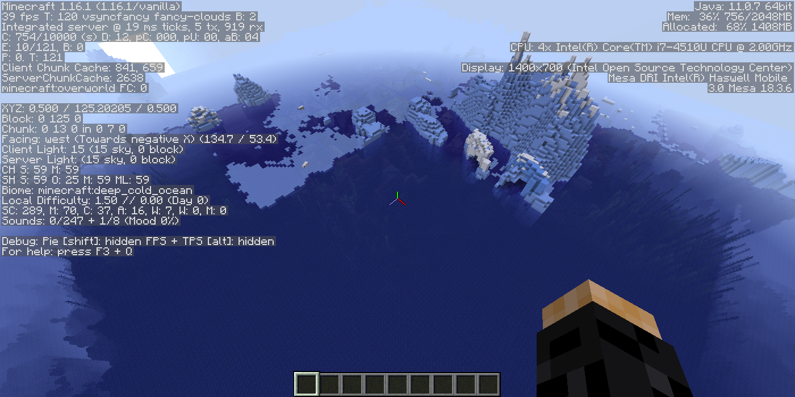
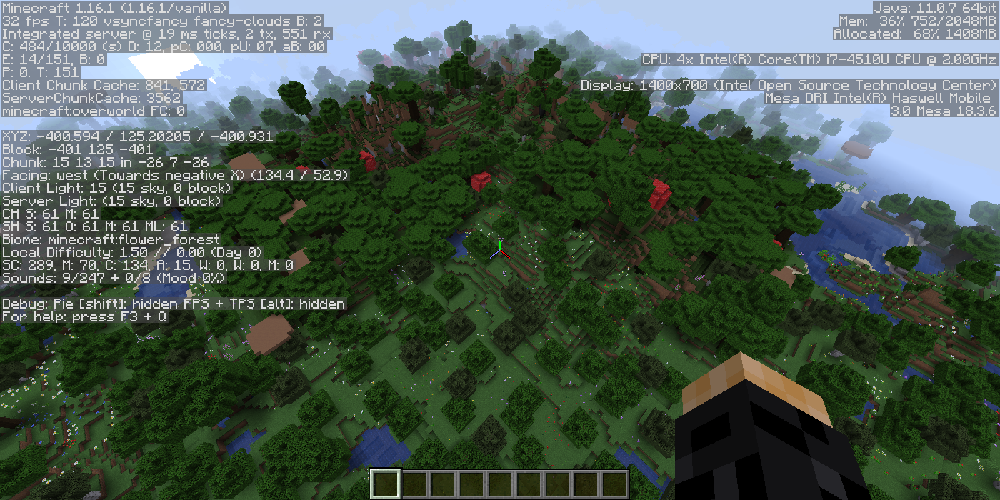
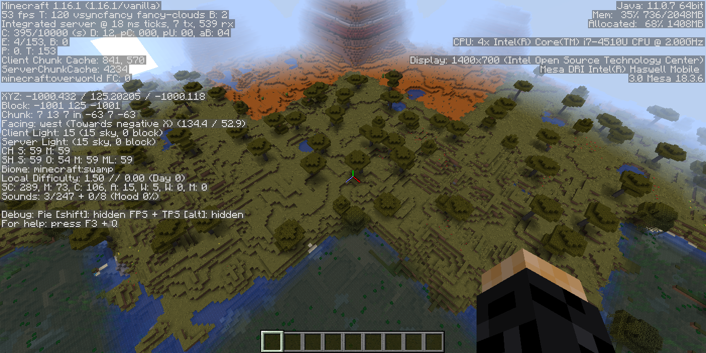
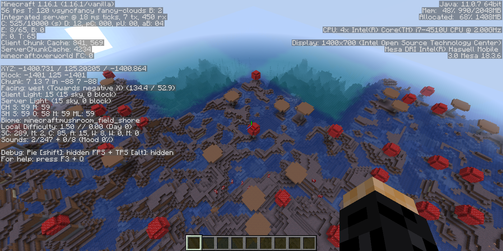

# Small, specific, biomes for Minecraft Linux Java Edition #

**Tested under Linux Java Edition 1.16.1.**

Creates a world with only the biomes listed in the order listed.
Because of the checkerboard type definition, the biomes repeat on a diagonal corner, but do change in the cardinal directions (N,S,E,W).
You can traverse all the biomes listed here by walking (about) 2000 clicks in any cardinal direction.

Some goals I set for myself with this world:
- Temperature makes sense, *I think*.
- Blending the biomes to decrease the noticable different between them.  That was only partially successful.
- Explore a lot of biomes without having to travel too far from my home base.

I think the forest biomes blended very well

but the biome change between swamp and savanna was quite noticeable.

and even more noticeable with the oceans.

